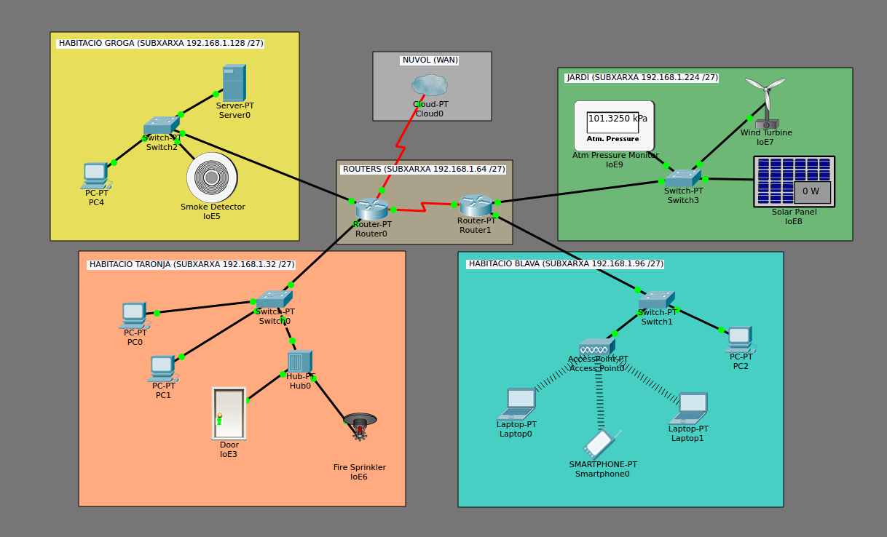

# Network Protocols Simulation for a Smart House
Study of the usage and functionality of multiple network protocols of the TCP/IP stack applied to a simulated smart house. The Cisco Packet Tracer simulator was used.

| | |
|-|-|
| **Language**   | Catalan |
| **Authors** | Albert Espín, Pau Sanchez and Guillem Casassas |
| **Date**  | January 2017  |

